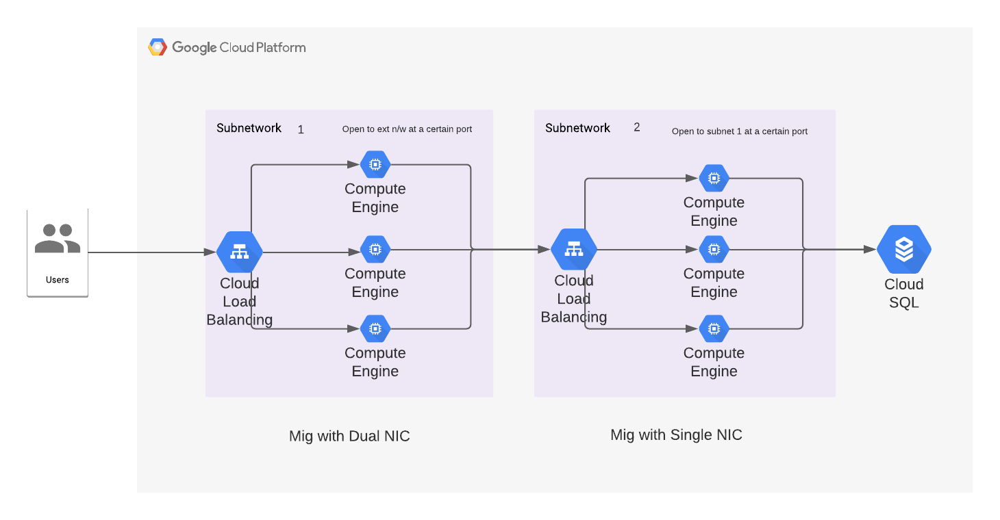

# Challenge1

## Problem Statement

A 3-tier environment is a common setup. Use a tool of your choosing/familiarity create these resources. Please remember we will not be judged on the outcome but more focusing on the approach, style and reproducibility.

## Approach

A 3 tier architecture can be broken down to 3 layers:

- Presentation (End User) Layer
- Business Logic (Application) Layer
- Storage Layer.

To create a 3 tier architecture. I'll be creating a VPC in GCP which will have 2 subnets in it. We will keep our end user layer in the subnet 1 which will be open to external network at a certain port for end user. we will be using load balancer to balance load b/w a managed instance group for scalability and high availablity . This mig will be a dual nic so that it can pass the request to our middle layer (application/logic) at a certain port. The middle layer will be on a separate subnet. Then we can pass our request to db through the 2nd layer securely.

I'll be using terraform to create all these modules to keep our IAC for reusability and state management.

## Assumptions

- The service account or vm with which we will be running the terraform has the right access to run and create infrastructure.
- We have a bucket to store or backend i.e. state files of terraform.
- Variables and parameters are being passed correctly.
